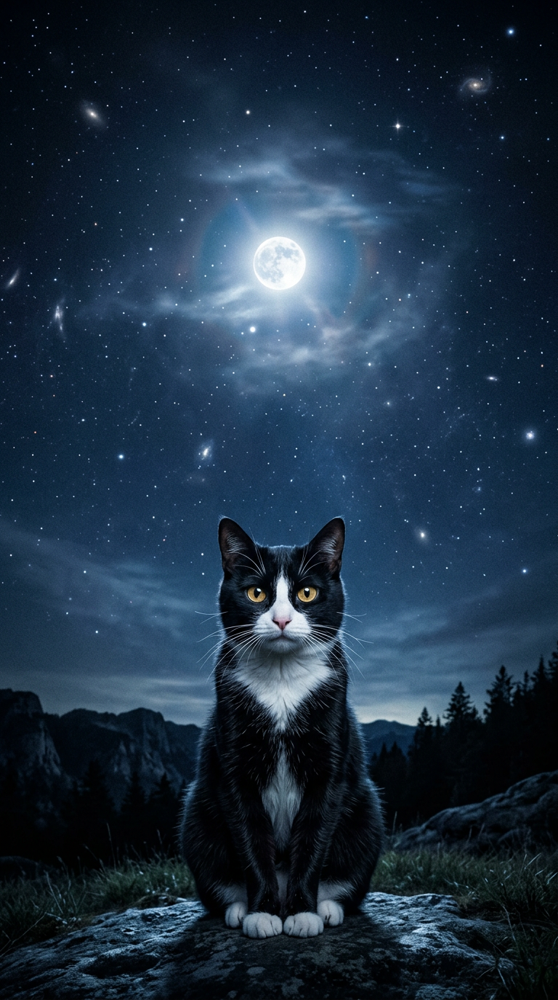
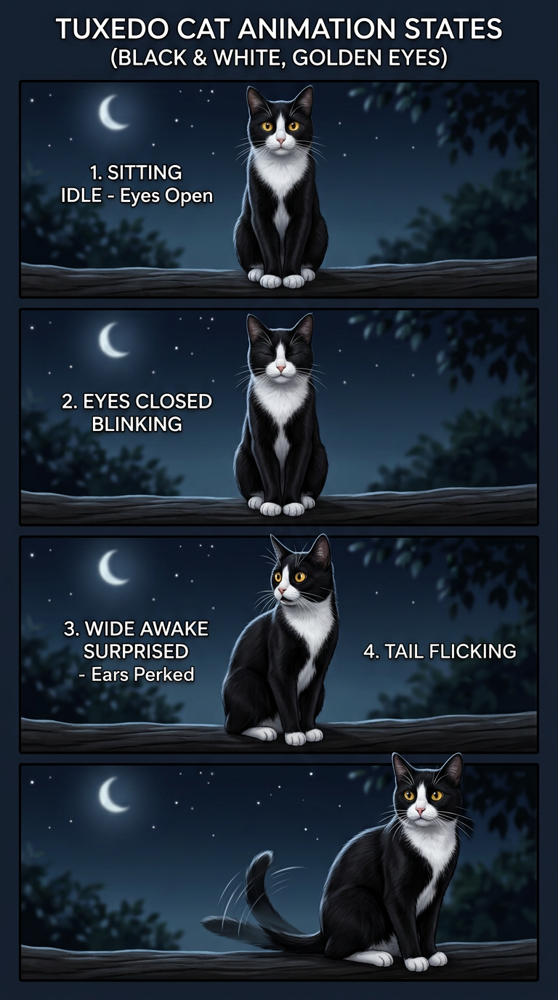

# Cat Parallax Live Wallpaper 🐱

A home-screen live wallpaper for the **Samsung Galaxy F23 (Android 14 / One UI 6.1)**:
a realistic black tuxedo cat with golden eyes on a moonlit night who

- **shifts with phone tilt** — gyroscope parallax across 15 depth layers (moon, stars, hills, glow, cat parts, bokeh),
- **wakes up and greets you** the moment you unlock (`ACTION_USER_PRESENT`),
- **stays alive while idle** — randomized blinks and tail flicks every 4–12 s,
- and can be **stopped instantly** from a home-screen widget, a Quick Settings tile, or the OS itself.

Built to the PRD in [`docs/PRD.md`](docs/PRD.md) (M1–M8, including the stretch tile).
Zero permissions, zero third-party dependencies, APK < 300 KB.

|  |  |
|---|---|
| Idle scene (preview render) | Animation & tilt states (preview render) |

The previews above were rendered by [`tools/cat_design.py`](tools/cat_design.py) using the
**exact same geometry** (`assets/cat/default_cat.json`) the on-device renderer draws.

---

## Getting the APK on your F23

The repo builds itself with GitHub Actions (see
[`setup/android-build.yml`](setup/android-build.yml) — needs a one-time paste,
60 seconds, instructions at the top of that file). Every push to `main`
publishes a signed APK to [Releases](../../releases).

On the phone:

1. Download the latest `*.apk` from Releases, open it, allow install from
   unknown sources for your browser.
2. Apply it — either from the app (**Cat Parallax** → *Set as home screen
   wallpaper*), or the One UI way: **Settings → Wallpaper and style →
   Change wallpapers → ⋮ (top right) → Live wallpapers → Cat Parallax**, then
   choose **Home screen**.
3. Long-press the home screen → **Widgets** → **Cat On/Off** → drop the 2×1
   kill switch anywhere you like.
4. Optional: pull down the shade, edit Quick Settings tiles, add **Cat**.

## The kill switch (soft stop vs hard stop)

- **Widget / QS tile / Settings toggle = soft stop.** The wallpaper stays
  applied but freezes: sensor listeners unregistered, animation timers
  cancelled, last frame kept as a static image. One tap reverses it.
- **Force Stop / swipe away = hard stop.** There is deliberately no foreground
  service and no notification, so Android kills everything cleanly — and the
  system reverts to your previous wallpaper. Re-select the live wallpaper to
  bring the cat back (the app remembers her ON/OFF state).

This distinction is also shown once inside the Settings screen, as the PRD
requires.

## Settings

- **Tilt sensitivity** (0.2×–3×), **battery saver** (no idle animations,
  slower sensor polling), **per-layer toggles** (stars, hills, whiskers, tail,
  bokeh) — all live-previewed by the same renderer the wallpaper uses.
- Tap the preview to watch the wake animation.

## Using your own cat artwork

The built-in cat is a realistic black tuxedo cat drawn from code. If you have layered
artwork (body / tail / ears / eyes as separate PNGs), see
[`app/src/main/assets/cat/custom/README.md`](app/src/main/assets/cat/custom/README.md)
— drop the PNGs in, rebuild, done. The loader falls back to the built-in cat
unless the minimum set is present.

## Architecture

Exactly the PRD §5 layout, with three documented deviations
(`SharedPreferences` instead of DataStore for synchronous engine reads;
widget-tap handling folded into `CatToggleWidgetProvider` + engine-side
`CatStateReceiver`; no Lottie — procedural Canvas animation):

```
app/src/main/java/com/tarun1sisodia/catparallax/
├── CatWallpaperService.kt        # WallpaperService entry point
├── engine/
│   ├── CatEngine.kt              # Engine: draw loop, lifecycle, receivers, throttling
│   ├── SensorFusion.kt           # TYPE_GAME_ROTATION_VECTOR + low-pass + auto re-baseline
│   ├── ParallaxLayer.kt          # scene models (layers, shapes, paths, variants)
│   ├── SceneLoader.kt            # default_cat.json / custom PNGs -> CatScene (+ PathParser)
│   └── SceneRenderer.kt          # depth-scaled parallax + role animation compositing
├── animation/
│   ├── AnimationState.kt         # IDLE / WAKING / BLINK / TAIL_FLICK / PAUSED (+ ANGRY_BITE reserved)
│   ├── AnimationController.kt    # state machine + randomized idle timer (only redraws while animating)
│   └── UnlockAnimator.kt         # ACTION_USER_PRESENT -> one-shot wake (queues if not visible)
├── settings/
│   ├── SettingsActivity.kt       # sensitivity, battery saver, layer toggles, preview, apply
│   ├── CatPreviewView.kt         # live preview using the real renderer
│   └── PrefsRepository.kt        # single prefs source + state-change broadcast
├── widget/CatToggleWidgetProvider.kt  # 2×1 ON/OFF kill switch
├── tile/CatTileService.kt        # Quick Settings tile (M8)
└── receiver/                     # UnlockReceiver, CatStateReceiver (engine-registered)
```

Battery profile (PRD §8): no fixed frame loop — the surface is redrawn only
when the filtered tilt moves past a threshold or an animation is active;
sensors are fully unregistered whenever the wallpaper isn't visible; battery
saver mode drops the sensor rate to NORMAL and disables idle behaviors.

## Building locally

Android Studio: open the project, Run. Or CLI:

```bash
./gradlew assembleRelease   # signed with the committed personal keystore
```

Art tools (optional, regenerates the cat + icons):

```bash
pip install pillow
python3 tools/cat_design.py
```

## Release signing note

`app/signing/release.keystore` is committed on purpose: this is a personal,
zero-permission, sideload-only app, and committing the key keeps CI builds
consistently signed so new APKs install as updates. If you ever publish
publicly, rotate the key and move the passwords into CI secrets
(`keystore.properties` is the only place they live).

## Phase 2 (not in this build)

The "angry bite on double-tap-lock" feature (PRD §9.5) is scaffolded but
dormant: `AnimationState.ANGRY_BITE` and the `UnlockAnimator` hook are in
place; it needs the angry sprite variant and the double-tap flag plumbing.
